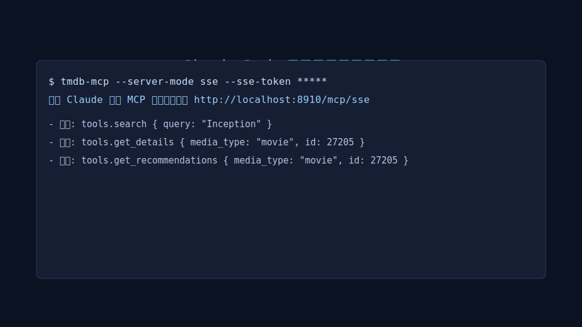
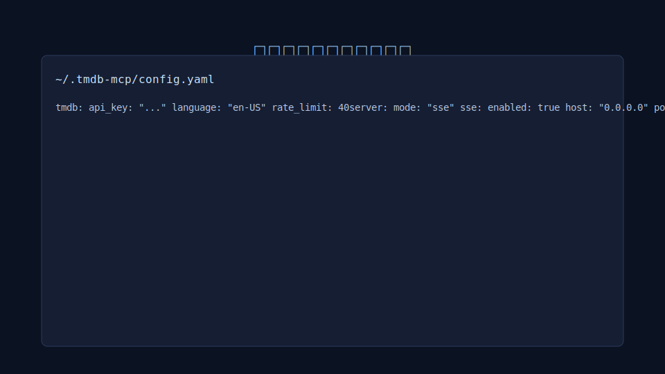

<div align="center">

# TMDB MCP Server

[](https://github.com/XDwanj/tmdb-mcp)
[]
[](https://go.dev/)
[](https://github.com/XDwanj/tmdb-mcp/actions)
[](#)

An MCP (Model Context Protocol) server for The Movie Database (TMDB): search, details, discovery, trending, and recommendations — ready for stdio and SSE modes, with Docker support.

[English](README.md) | [简体中文](README.zh-CN.md)

</div>

## Overview

TMDB MCP Server exposes six MCP tools so AI coding assistants and MCP clients (e.g., Claude Code) can search and retrieve movie/TV data from TMDB.

## Quick Start

### Prerequisites
- Go 1.21+
- A valid TMDB API Key (https://www.themoviedb.org/settings/api)

### Run (stdio mode)

```bash
TMDB_API_KEY=your_api_key go run ./cmd/tmdb-mcp --server-mode stdio
```

This starts the server over stdio. Connect with an MCP-compatible client via stdio transport.

### Run (SSE mode)

```bash
# Option A: Let the app generate a token and persist to ~/.tmdb-mcp/config.yaml
TMDB_API_KEY=your_api_key \
SERVER_MODE=sse \
go run ./cmd/tmdb-mcp

# Option B: Provide your own token
TMDB_API_KEY=your_api_key \
SERVER_MODE=sse \
SSE_TOKEN=$(openssl rand -base64 32) \
go run ./cmd/tmdb-mcp

# Health check
curl -s http://localhost:8910/health
```

### Docker

```bash
docker build -t tmdb-mcp .
docker run --rm -p 8910:8910 \
  -e TMDB_API_KEY=your_api_key \
  -e SERVER_MODE=sse \
  -e SSE_TOKEN=$(openssl rand -base64 32) \
  tmdb-mcp
```

Or use docker-compose: see `examples/docker-compose.yml`.

## Features

Exposed MCP tools:
- `search` — Search movies/TV by query
- `get_details` — Get details by media type and ID
- `discover_movies` — Discover movies with rich filters
- `discover_tv` — Discover TV with rich filters
- `get_trending` — Trending items by media type and window
- `get_recommendations` — Recommendations based on a movie/TV ID

Typical flows:
- search → get_details
- discover_movies → get_recommendations
- get_trending → get_details

## Configuration

Configuration sources and priority: CLI flags > Environment variables > Config file.

Flags (subset):
- `--tmdb-api-key`, `--tmdb-language`, `--tmdb-rate-limit`
- `--server-mode`, `--sse-host`, `--sse-port`, `--sse-token`
- `--logging-level`

Environment variables (when flags are not provided):
- `TMDB_API_KEY`, `TMDB_LANGUAGE`, `TMDB_RATE_LIMIT`
- `SERVER_MODE`, `SERVER_SSE_HOST`, `SERVER_SSE_PORT`, `SSE_TOKEN`
- `LOGGING_LEVEL`

Config file (fallback): `~/.tmdb-mcp/config.yaml`
See `examples/config.yaml` for a complete example.

Key fields:
- `tmdb.api_key`, `tmdb.language`, `tmdb.rate_limit`
- `server.mode` (stdio|sse|both), `server.sse.host`, `server.sse.port`, `server.sse.token`
- `logging.level`

## Deployment

- Local binary: `go build -o tmdb-mcp ./cmd/tmdb-mcp`
- Docker: `docker build -t tmdb-mcp .`
- Docker Compose: `examples/docker-compose.yml`
- Kubernetes: expose the container at port 8910 and configure `SSE_TOKEN`/`TMDB_API_KEY` via secrets

## Screenshots

Claude Code usage (placeholder):



Config example (placeholder):



## Development

- Format: `go fmt ./...`
- Vet: `go vet ./...`
- Test: `go test ./...`
- Lint (Markdown): run your preferred linter locally (e.g., markdownlint)
- Code style and structure: see `docs/architecture/coding-standards.md` and `docs/architecture/source-tree.md`

## Contributing

1) Open an issue to discuss changes
2) Fork and create a feature branch
3) Add tests and docs
4) Submit a PR for review

## License

TBD. Please add a LICENSE file (e.g., MIT) to this repository.

## Acknowledgements

- TMDB for the API and data
- MCP Go SDK https://github.com/modelcontextprotocol/go-sdk
