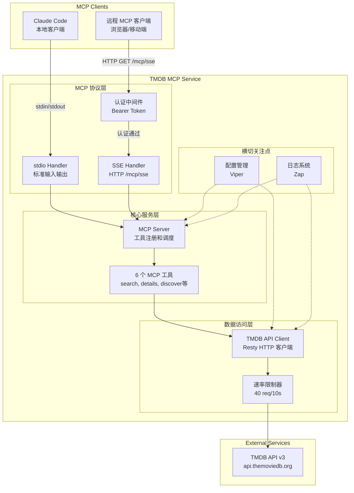
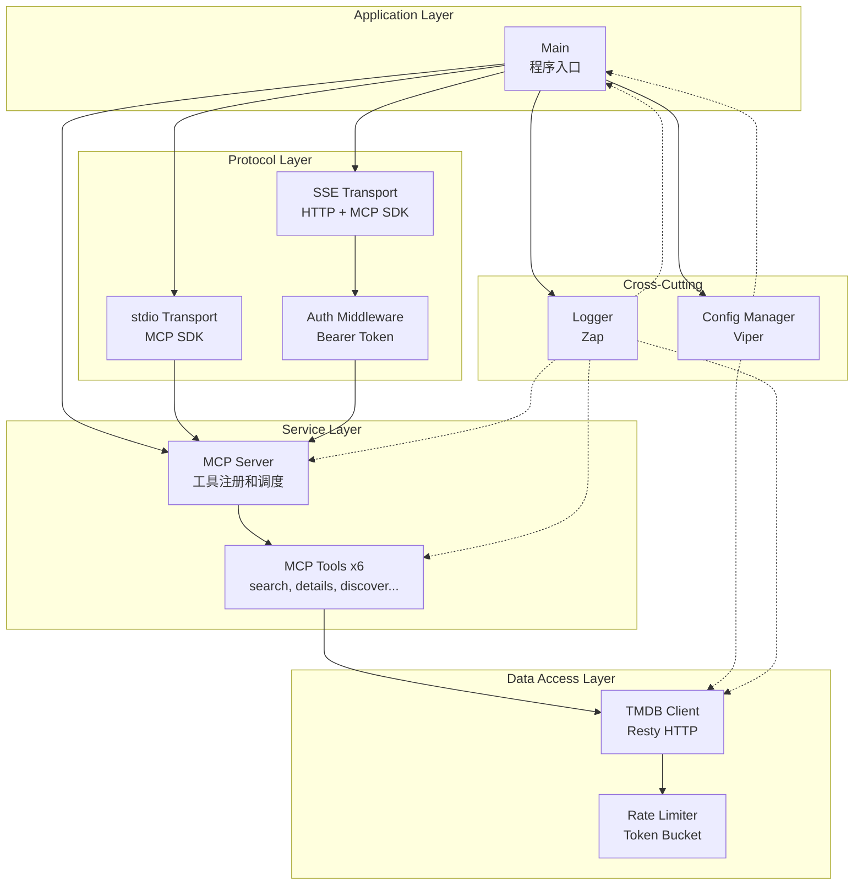
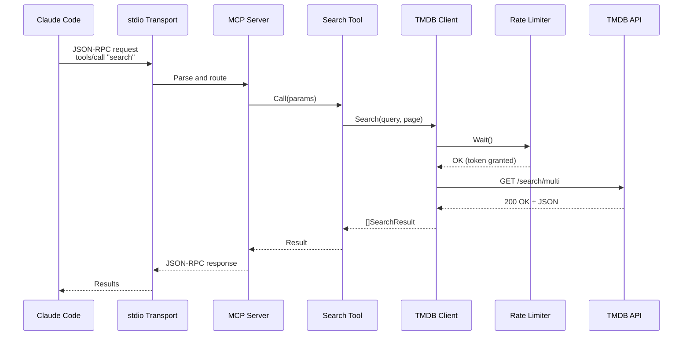
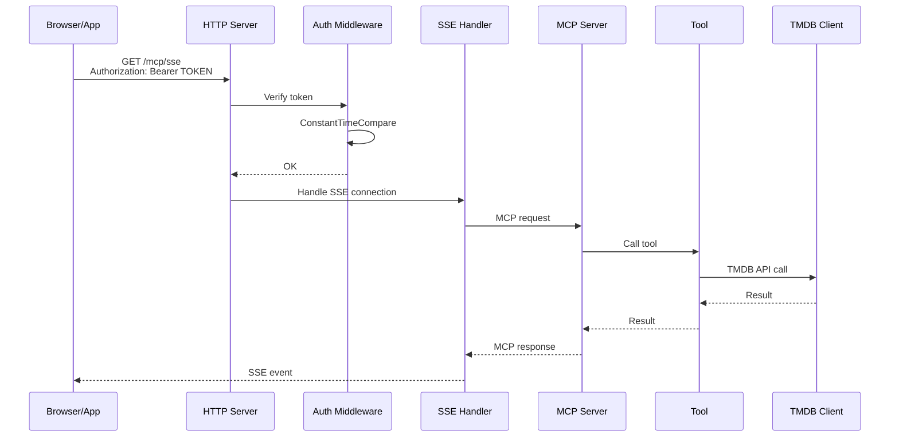

# TMDB MCP 服务架构文档

This document outlines the overall project architecture for TMDB MCP 服务, including backend systems, shared services, and non-UI specific concerns. Its primary goal is to serve as the guiding architectural blueprint for AI-driven development, ensuring consistency and adherence to chosen patterns and technologies.

**Relationship to Frontend Architecture:**
If the project includes a significant user interface, a separate Frontend Architecture Document will detail the frontend-specific design and MUST be used in conjunction with this document. Core technology stack choices documented herein (see "Tech Stack") are definitive for the entire project, including any frontend components.

**Note**: 本项目为 CLI/MCP 服务,无传统用户界面。用户通过 MCP 客户端(如 Claude Code)与服务交互。

## Starter Template or Existing Project

**项目类型**: Greenfield 项目(全新创建)

**决策**: 不使用 Starter Template

**理由**:
1. **Go 项目特性**: Golang 项目通常采用标准项目布局,不需要复杂脚手架
2. **精简原则**: PRD 明确要求精简工具链,仅使用 Go 原生工具(`go build`, `go test`, `go fmt`, `go vet`)
3. **技术栈明确**: 所有核心依赖已在 PRD 中定义(MCP SDK, Resty, Viper, Zap 等)
4. **项目结构清晰**: 采用标准 Go 布局:`cmd/tmdb-mcp/`, `internal/`, `pkg/`

**项目初始化方式**:
```bash
go mod init github.com/[username]/tmdb-mcp
mkdir -p cmd/tmdb-mcp internal pkg
```

## Change Log

| Date | Version | Description | Author |
|------|---------|-------------|--------|
| 2025-10-10 | 0.1 | 初始架构文档创建 | Winston (Architect) |

---

## High Level Architecture

### Technical Summary

TMDB MCP 服务采用**分层单体架构**(Layered Monolith),以 Golang 1.21+ 实现。系统通过 MCP 协议暴露 6 个核心工具,支持 stdio 和 SSE 双模式通信。核心组件包括 MCP 协议层、工具编排层、TMDB API 客户端层和速率限制层。架构设计确保高性能(P95 < 500ms)、类型安全和天然并发支持,同时遵循精简原则,仅使用 Go 原生工具链。该设计直接支持 PRD 中定义的智能文件重命名、内容发现和推荐等核心场景。

### High Level Overview

**架构风格**: **Layered Monolith**(分层单体架构)

**Repository 结构**: **Monorepo** - 单个 Git 仓库包含所有代码

**Service 架构**: **Single-Process Service** - 单进程服务,支持 stdio 和 SSE 双模式

**核心架构层次**:
```
┌─────────────────────────────────────────────────┐
│          MCP 协议层 (Protocol Layer)              │
│  - stdio transport (标准输入/输出)                │
│  - SSE transport (HTTP Server-Sent Events)      │
│  - JSON-RPC 2.0 消息处理                         │
└─────────────────────────────────────────────────┘
                      ↓
┌─────────────────────────────────────────────────┐
│         工具层 (Tools Layer)                     │
│  - search, get_details, discover_movies         │
│  - discover_tv, get_trending, get_recommendations│
│  - 参数验证和结果转换                             │
└─────────────────────────────────────────────────┘
                      ↓
┌─────────────────────────────────────────────────┐
│      TMDB 客户端层 (TMDB Client Layer)           │
│  - HTTP 请求封装 (Resty)                         │
│  - 错误处理和重试逻辑                             │
│  - 响应解析和类型映射                             │
└─────────────────────────────────────────────────┘
                      ↓
┌─────────────────────────────────────────────────┐
│     速率限制层 (Rate Limiter Layer)               │
│  - Token Bucket 算法 (40 req/10s)                │
│  - 并发请求队列管理                               │
└─────────────────────────────────────────────────┘
                      ↓
┌─────────────────────────────────────────────────┐
│         TMDB API v3 (外部服务)                    │
└─────────────────────────────────────────────────┘
```

**关键架构决策**:

1. **单体 vs 微服务**: 选择单体架构
   - **理由**: MVP 阶段功能单一,6 个工具共享 TMDB 客户端和速率限制器,微服务会引入不必要的复杂性

2. **双模式支持**: stdio + SSE 同时运行
   - **理由**: stdio 模式用于本地 Claude Code 集成,SSE 模式支持远程访问和多客户端连接
   - **实现**: 共享工具层和 TMDB 客户端,仅传输层不同

3. **分层设计**: 清晰的职责分离
   - **协议层**: 仅处理通信和消息序列化
   - **工具层**: 业务逻辑和参数验证
   - **客户端层**: TMDB API 交互
   - **速率限制层**: 保证不触发 TMDB 限流

### High Level Project Diagram



### Architectural and Design Patterns

以下是指导本架构的关键高级模式:

- **Layered Architecture (分层架构)**: 将系统分为协议层、业务层、数据访问层,确保职责清晰分离和可测试性 - _Rationale:_ 单进程架构中最佳实践,支持独立测试每一层,符合 SOLID 原则

- **Dependency Injection (依赖注入)**: 通过构造函数注入依赖(如 TMDBClient 注入到 Tools) - _Rationale:_ Go 的惯用方式,便于单元测试时 Mock 外部依赖,无需引入 DI 框架

- **Repository Pattern (仓储模式)**: TMDBClient 作为数据访问抽象,隐藏 HTTP 调用细节 - _Rationale:_ 工具层无需关心 TMDB API 的 HTTP 细节,未来可替换为其他数据源

- **Middleware Pattern (中间件模式)**: SSE 模式使用标准库 `net/http` 中间件实现认证 - _Rationale:_ Go HTTP 标准模式,可组合和复用,符合 Go 惯用法

- **Rate Limiting Pattern (速率限制模式)**: 使用 Token Bucket 算法控制 TMDB API 调用频率 - _Rationale:_ 防止触发 TMDB 429 错误,Token Bucket 平滑处理突发流量

- **Dual Mode Pattern (双模式模式)**: stdio 和 SSE 共享业务逻辑,仅传输层不同 - _Rationale:_ 避免代码重复,两种模式使用相同的工具实现和 TMDB 客户端,降低维护成本

- **Graceful Shutdown Pattern (优雅关闭模式)**: 捕获 SIGINT/SIGTERM 信号,等待活跃连接完成后关闭 - _Rationale:_ 确保请求处理完整,避免数据丢失或不一致状态

---

## Tech Stack

### Cloud Infrastructure

**Provider**: N/A - 自托管部署

**说明**:
- 本项目为 **自托管工具**，无需云服务商
- 用户在本地机器或自己的服务器上运行
- 部署方式：独立二进制文件或 Docker 容器
- 无云服务依赖，无运行时成本

**可选云部署**:
- 用户可自行选择任何云服务商（AWS, GCP, Azure, DigitalOcean 等）
- 仅需支持 Linux 容器的环境即可
- 建议配置：1 vCPU, 512MB RAM（轻量级部署）

### Technology Stack Table

基于 PRD Technical Assumptions 和精简原则，以下是最终技术栈选择：

| Category | Technology | Version | Purpose | Rationale |
|----------|-----------|---------|---------|-----------|
| **Language** | Go | 1.21+ | 主开发语言 | 类型安全、高性能、优秀并发模型、编译为独立二进制 |
| **Runtime** | Go Runtime | 1.21+ | 程序运行环境 | 跨平台支持（Linux/macOS/Windows）、静态链接、启动快 |
| **MCP SDK** | `github.com/modelcontextprotocol/go-sdk` | 最新稳定版 | MCP 协议实现 | 官方 Go SDK，内置 stdio 和 SSE 支持，遵循规范 |
| **HTTP Client** | `github.com/go-resty/resty/v2` | v2.11.0+ | TMDB API 调用 | 链式 API、自动重试、中间件支持、超时控制 |
| **HTTP Server** | `net/http` (标准库) | Go 1.21+ | SSE HTTP 服务器 | 标准库稳定可靠、零依赖、配合 MCP SDK 的 SSEHTTPHandler |
| **Rate Limiter** | `golang.org/x/time/rate` | v0.5.0+ | API 速率限制 | 官方扩展库、Token Bucket 算法、并发安全 |
| **Logging** | `go.uber.org/zap` | v1.26.0+ | 结构化日志 | 高性能、零分配、JSON 输出、日志级别控制 |
| **Configuration** | `github.com/spf13/viper` | v1.18.0+ | 配置管理 | 多源支持（文件/ENV/CLI）、优先级控制、热重载 |
| **Testing** | `testing` (标准库) | Go 1.21+ | 单元测试 | Go 原生测试框架，`go test` 命令 |
| **Testing - Mocking** | `github.com/stretchr/testify` | v1.8.4+ | Mock 和断言 | 丰富的断言、Mock 支持、与标准库兼容 |
| **Security - Token** | `crypto/rand` (标准库) | Go 1.21+ | SSE Token 生成 | 加密安全的随机数生成、标准库零依赖 |
| **Security - Auth** | `crypto/subtle` (标准库) | Go 1.21+ | Token 比对 | 常量时间比对，防止时序攻击 |
| **Build Tool** | `go build` | Go 1.21+ | 编译二进制 | Go 原生工具，无需 Makefile |
| **Formatting** | `go fmt` | Go 1.21+ | 代码格式化 | Go 官方格式化工具 |
| **Static Analysis** | `go vet` | Go 1.21+ | 静态检查 | Go 官方静态分析工具 |
| **Containerization** | Docker | 24.0+ | 容器化部署 | 多平台镜像、轻量 Alpine 基础镜像、Docker Compose 支持 |

### 关键技术决策说明

**1. 为什么选择 Go 1.21+？**
- **类型安全**: 编译时捕获错误，减少运行时故障
- **并发模型**: Goroutines 和 channels 天然支持并发处理 TMDB API 调用
- **部署简单**: 编译为单个二进制文件，无需运行时依赖
- **性能优异**: 满足 P95 < 500ms 的响应时间要求
- **启动快速**: 满足 < 2 秒启动时间要求

**2. 为什么选择标准库 `net/http` 而非 Gin/Echo？**
- **精简原则**: PRD 明确要求避免不必要的框架
- **MCP SDK 兼容**: MCP SDK 的 `SSEHTTPHandler` 实现了 `http.Handler` 接口，直接兼容标准库
- **零依赖**: 标准库稳定可靠，无版本冲突风险
- **足够功能**: 仅需 `/mcp/sse` 和 `/health` 两个端点，标准库完全满足

**3. 为什么选择 Resty 而非标准库 `net/http` 客户端？**
- **链式 API**: 更简洁的代码风格（`client.R().SetQueryParam().Get()`）
- **自动重试**: 内置重试逻辑，处理 TMDB API 临时故障
- **中间件支持**: 方便统一添加日志、指标记录
- **超时控制**: 更好的超时和取消控制

**4. 为什么选择 Viper 配置管理？**
- **多源支持**: 文件、环境变量、命令行 flags 三种来源
- **优先级控制**: CLI > ENV > File，符合 12-factor app 原则
- **生态成熟**: Go 社区广泛使用，文档完善

**5. 为什么不使用数据库？**
- **纯 API 转发**: 所有数据来自 TMDB API，无需持久化
- **无状态设计**: 每次请求独立，符合 MCP 协议特性
- **简化运维**: 用户无需管理数据库，降低部署门槛

**6. 为什么不使用缓存（Redis/Memcached）？**
- **实时性要求**: PRD 明确要求实时数据，避免过期内容
- **MVP 范围**: 第一版聚焦核心功能，缓存属于优化范畴
- **TMDB 速率限制**: 40 req/10s 足够支持单用户场景，无需缓存

### 精简原则落地

**不使用的工具/库**:
- ❌ Makefile - 仅使用 `go build`, `go test`
- ❌ golangci-lint - 仅使用 `go vet`
- ❌ 其他 linter（staticcheck, errcheck 等）
- ❌ Web 框架（Gin, Echo, Fiber）
- ❌ ORM 框架（无数据库需求）
- ❌ 依赖注入框架（wire, dig）- 手动构造函数注入

**构建命令示例**:
```bash
# 编译
go build -o tmdb-mcp ./cmd/tmdb-mcp

# 测试
go test ./...

# 格式化
go fmt ./...

# 静态检查
go vet ./...

# 运行
./tmdb-mcp
```

---

## Data Models

**说明**: 本项目为无状态 API 转发服务，无数据库和持久化需求。以下定义的是**内部数据结构**（Go structs），用于配置管理、TMDB API 交互和 MCP 工具实现。

### Configuration Model

**Purpose**: 管理服务配置，支持从文件、环境变量、命令行 flags 三种来源加载

**Go Struct 定义**:
```go
type Config struct {
    TMDB      TMDBConfig   `mapstructure:"tmdb"`
    Server    ServerConfig `mapstructure:"server"`
    Logging   LogConfig    `mapstructure:"logging"`
}

type TMDBConfig struct {
    APIKey    string `mapstructure:"api_key"`    // TMDB API Key（必需）
    Language  string `mapstructure:"language"`   // 语言偏好（默认 "en-US"）
    RateLimit int    `mapstructure:"rate_limit"` // 速率限制（默认 40 req/10s）
}

type ServerConfig struct {
    Mode string    `mapstructure:"mode"` // "stdio", "sse", "both"（默认 "both"）
    SSE  SSEConfig `mapstructure:"sse"`
}

type SSEConfig struct {
    Enabled bool   `mapstructure:"enabled"` // 是否启用 SSE 模式
    Host    string `mapstructure:"host"`    // 监听地址（默认 "0.0.0.0"）
    Port    int    `mapstructure:"port"`    // 监听端口（默认 8910）
    Token   string `mapstructure:"token"`   // Bearer Token（自动生成或手动设置）
}

type LogConfig struct {
    Level string `mapstructure:"level"` // "debug", "info", "warn", "error"
}
```

**Key Attributes**:
- `TMDB.APIKey`: string - TMDB API 认证密钥，从环境变量 `TMDB_API_KEY` 或配置文件读取
- `Server.Mode`: string - 运行模式，支持 stdio、sse、both 三种值
- `SSE.Token`: string - SSE 认证 Token，优先级：ENV > 配置文件 > 自动生成
- `Logging.Level`: string - 日志级别，控制 Zap logger 的输出详细程度

**Relationships**:
- Config 是顶层结构，包含 TMDB、Server、Logging 三个子配置
- 通过 Viper 加载，支持 `mapstructure` tag 映射 YAML 字段

### TMDB API Response Models

**Purpose**: 封装 TMDB API 的响应数据，提供类型安全的数据访问

**关键模型**:

#### SearchResult（搜索结果）

```go
type SearchResult struct {
    ID           int     `json:"id"`
    MediaType    string  `json:"media_type"`    // "movie", "tv", "person"
    Title        string  `json:"title"`         // 电影标题
    Name         string  `json:"name"`          // 电视剧/人物名称
    ReleaseDate  string  `json:"release_date"`  // 上映日期
    FirstAirDate string  `json:"first_air_date"` // 首播日期
    VoteAverage  float64 `json:"vote_average"`  // 评分
    Overview     string  `json:"overview"`      // 简介
}
```

#### MovieDetails（电影详情）

```go
type MovieDetails struct {
    ID          int      `json:"id"`
    Title       string   `json:"title"`
    ReleaseDate string   `json:"release_date"`
    Runtime     int      `json:"runtime"`
    VoteAverage float64  `json:"vote_average"`
    Overview    string   `json:"overview"`
    Genres      []Genre  `json:"genres"`
    Credits     Credits  `json:"credits"`      // 自动追加
    Videos      Videos   `json:"videos"`       // 自动追加
}

type Genre struct {
    ID   int    `json:"id"`
    Name string `json:"name"`
}

type Credits struct {
    Cast []CastMember `json:"cast"`
    Crew []CrewMember `json:"crew"`
}

type CastMember struct {
    ID        int    `json:"id"`
    Name      string `json:"name"`
    Character string `json:"character"`
}
```

#### TVDetails（电视剧详情）

```go
type TVDetails struct {
    ID            int      `json:"id"`
    Name          string   `json:"name"`
    FirstAirDate  string   `json:"first_air_date"`
    NumberOfSeasons int    `json:"number_of_seasons"`
    VoteAverage   float64  `json:"vote_average"`
    Overview      string   `json:"overview"`
    Genres        []Genre  `json:"genres"`
    Credits       Credits  `json:"credits"` // 自动追加
    Videos        Videos   `json:"videos"`  // 自动追加
}
```

#### PersonDetails（人物详情）

```go
type PersonDetails struct {
    ID          int    `json:"id"`
    Name        string `json:"name"`
    Birthday    string `json:"birthday"`
    Biography   string `json:"biography"`
    KnownForDepartment string `json:"known_for_department"`
    CombinedCredits    CombinedCredits `json:"combined_credits"` // 自动追加
}
```

**Relationships**:
- SearchResult 是统一搜索结果，通过 `MediaType` 区分电影/电视剧/人物
- Details 模型通过 `Credits` 和 `Videos` 嵌套关联演职员表和视频数据
- 所有模型使用 JSON tags 与 TMDB API 响应字段映射

### MCP Tool Parameter Models

**Purpose**: 定义 MCP 工具的输入参数结构，用于参数验证和类型转换

#### SearchParams

```go
type SearchParams struct {
    Query string `json:"query"` // 搜索关键词（必需）
    Page  int    `json:"page"`  // 页码（可选，默认 1）
}
```

#### GetDetailsParams

```go
type GetDetailsParams struct {
    MediaType string `json:"media_type"` // "movie", "tv", "person"（必需）
    ID        int    `json:"id"`         // TMDB ID（必需）
}
```

#### DiscoverMoviesParams

```go
type DiscoverMoviesParams struct {
    WithGenres         string  `json:"with_genres"`          // 类型 ID（逗号分隔）
    PrimaryReleaseYear int     `json:"primary_release_year"` // 上映年份
    VoteAverageGte     float64 `json:"vote_average.gte"`     // 最低评分
    VoteAverageLte     float64 `json:"vote_average.lte"`     // 最高评分
    WithOriginalLanguage string `json:"with_original_language"` // 语言代码
    SortBy             string  `json:"sort_by"`              // 排序方式
    Page               int     `json:"page"`                 // 页码
}
```

#### DiscoverTVParams

```go
type DiscoverTVParams struct {
    WithGenres         string  `json:"with_genres"`
    FirstAirDateYear   int     `json:"first_air_date_year"`
    VoteAverageGte     float64 `json:"vote_average.gte"`
    VoteAverageLte     float64 `json:"vote_average.lte"`
    WithOriginalLanguage string `json:"with_original_language"`
    WithStatus         string  `json:"with_status"` // "Returning Series", "Ended" 等
    SortBy             string  `json:"sort_by"`
    Page               int     `json:"page"`
}
```

#### GetTrendingParams

```go
type GetTrendingParams struct {
    MediaType  string `json:"media_type"`  // "movie", "tv", "person"（必需）
    TimeWindow string `json:"time_window"` // "day", "week"（必需）
    Page       int    `json:"page"`        // 页码（可选）
}
```

#### GetRecommendationsParams

```go
type GetRecommendationsParams struct {
    MediaType string `json:"media_type"` // "movie", "tv"（必需）
    ID        int    `json:"id"`         // TMDB ID（必需）
    Page      int    `json:"page"`       // 页码（可选）
}
```

**Relationships**:
- 每个 Params 结构对应一个 MCP 工具
- 使用 JSON tags 与 MCP 协议的 JSON-RPC 参数映射
- 工具层负责将这些 Params 转换为 TMDB API 查询参数

### Error Model

**Purpose**: 统一错误处理和错误响应格式

```go
type TMDBError struct {
    StatusCode int    `json:"status_code"` // HTTP 状态码
    StatusMessage string `json:"status_message"` // TMDB API 错误消息
}

func (e *TMDBError) Error() string {
    return fmt.Sprintf("TMDB API Error %d: %s", e.StatusCode, e.StatusMessage)
}
```

**Key Attributes**:
- `StatusCode`: int - HTTP 状态码（401, 404, 429 等）
- `StatusMessage`: string - TMDB API 返回的错误消息

**Error Handling Flow**:
1. TMDB API 返回错误响应
2. 解析为 `TMDBError` 结构
3. 根据 `StatusCode` 决定重试或直接返回
4. 转换为 MCP 错误响应格式返回给客户端

---

**设计注意事项**:

1. **无 ORM 映射**: 所有结构直接映射 JSON，无需数据库注解
2. **类型安全**: 使用 Go 类型系统确保编译时类型检查
3. **JSON Tags**: 使用小写蛇形命名与 TMDB API 保持一致
4. **可扩展性**: 结构设计支持未来添加新字段（TMDB API 更新）
5. **内存效率**: 避免不必要的指针和嵌套，减少 GC 压力

---

## Components

基于分层架构，以下是核心组件及其职责定义：

### Main Application (cmd/tmdb-mcp/main.go)

**Responsibility**: 应用程序入口，负责初始化所有组件并启动服务

**Key Interfaces**:
- `func main()` - 程序入口函数
- 信号处理（SIGINT/SIGTERM）- 优雅关闭

**Dependencies**: Config, Logger, TMDB Client, MCP Server, HTTP Server

**Technology Stack**: Go 标准库（`os`, `os/signal`, `context`）

**Implementation Details**:
```go
func main() {
    // 1. 加载配置（Viper）
    config := loadConfig()

    // 2. 初始化日志（Zap）
    logger := initLogger(config.Logging)

    // 3. 创建 TMDB Client（Resty + Rate Limiter）
    tmdbClient := tmdb.NewClient(config.TMDB, logger)

    // 4. 创建 MCP Server（MCP SDK）
    mcpServer := mcp.NewServer(tmdbClient, logger)

    // 5. 根据模式启动服务
    if config.Server.Mode == "stdio" || config.Server.Mode == "both" {
        go mcpServer.ServeStdio()
    }
    if config.Server.Mode == "sse" || config.Server.Mode == "both" {
        go serveSSE(mcpServer, config.Server.SSE, logger)
    }

    // 6. 等待信号并优雅关闭
    waitForShutdown(mcpServer, logger)
}
```

### Config Manager (internal/config)

**Responsibility**: 管理配置加载、验证和优先级控制（CLI > ENV > File）

**Key Interfaces**:
- `func LoadConfig() (*Config, error)` - 加载配置
- `func ValidateConfig(*Config) error` - 验证配置有效性
- `func GenerateSSEToken() (string, error)` - 生成 SSE Token

**Dependencies**: Viper, crypto/rand

**Technology Stack**: `github.com/spf13/viper`, `crypto/rand`, `os`

**Configuration Priority**:
1. 命令行 flags（最高优先级）
2. 环境变量（`TMDB_API_KEY`, `SSE_TOKEN` 等）
3. 配置文件 `~/.tmdb-mcp/config.yaml`（默认优先级）

**Validation Rules**:
- TMDB API Key 必须存在且非空
- SSE 模式启用时，Token 必须存在或自动生成
- Rate Limit 必须 > 0（默认 40）
- Server Mode 必须是 "stdio", "sse", "both" 之一

### TMDB API Client (internal/tmdb)

**Responsibility**: 封装 TMDB API v3 调用，处理 HTTP 请求、错误和响应解析

**Key Interfaces**:
- `func Search(ctx context.Context, query string, page int) ([]SearchResult, error)`
- `func GetMovieDetails(ctx context.Context, id int) (*MovieDetails, error)`
- `func GetTVDetails(ctx context.Context, id int) (*TVDetails, error)`
- `func GetPersonDetails(ctx context.Context, id int) (*PersonDetails, error)`
- `func DiscoverMovies(ctx context.Context, params DiscoverMoviesParams) ([]MovieResult, error)`
- `func DiscoverTV(ctx context.Context, params DiscoverTVParams) ([]TVResult, error)`
- `func GetTrending(ctx context.Context, mediaType, timeWindow string, page int) ([]TrendingResult, error)`
- `func GetMovieRecommendations(ctx context.Context, id, page int) ([]MovieResult, error)`
- `func GetTVRecommendations(ctx context.Context, id, page int) ([]TVResult, error)`

**Dependencies**: Resty, Rate Limiter, Logger

**Technology Stack**: `github.com/go-resty/resty/v2`, `golang.org/x/time/rate`, Zap

**Implementation Pattern**:
```go
type Client struct {
    httpClient  *resty.Client
    rateLimiter *rate.Limiter
    apiKey      string
    language    string
    logger      *zap.Logger
}

func (c *Client) Search(ctx context.Context, query string, page int) ([]SearchResult, error) {
    // 1. 等待速率限制
    if err := c.rateLimiter.Wait(ctx); err != nil {
        return nil, err
    }

    // 2. 发起 HTTP 请求
    resp, err := c.httpClient.R().
        SetContext(ctx).
        SetQueryParam("query", query).
        SetQueryParam("page", strconv.Itoa(page)).
        Get("/search/multi")

    // 3. 错误处理（401/404/429）
    if err := c.handleError(resp); err != nil {
        return nil, err
    }

    // 4. 解析响应
    var result SearchResponse
    if err := json.Unmarshal(resp.Body(), &result); err != nil {
        return nil, err
    }

    return result.Results, nil
}
```

**Error Handling Strategy**:
- **401 Unauthorized**: 立即返回错误，记录 ERROR 日志
- **404 Not Found**: 返回空结果，记录 INFO 日志
- **429 Rate Limit**: 解析 `Retry-After` header，等待后重试（最多 3 次）
- **Network Timeout**: 返回错误，记录 WARN 日志
- **5xx Server Error**: 返回错误，记录 ERROR 日志

### Rate Limiter (internal/ratelimit)

**Responsibility**: 控制 TMDB API 调用频率，防止触发 429 错误

**Key Interfaces**:
- `func NewLimiter(ratePerSecond float64, burst int) *rate.Limiter` - 创建限制器
- `func Wait(ctx context.Context) error` - 等待获取令牌

**Dependencies**: golang.org/x/time/rate

**Technology Stack**: `golang.org/x/time/rate`

**Configuration**:
- **Rate**: 40 requests / 10 seconds = 4 req/s
- **Burst**: 40（允许短时突发）
- **Algorithm**: Token Bucket

**Usage**:
```go
// 创建限制器：每秒 4 个请求，突发 40
limiter := rate.NewLimiter(rate.Every(10*time.Second/40), 40)

// 每次 API 调用前等待
if err := limiter.Wait(ctx); err != nil {
    return err
}
```

### MCP Server (internal/mcp)

**Responsibility**: MCP 协议实现，工具注册和调度，stdio 和 SSE 模式支持

**Key Interfaces**:
- `func NewServer(tmdbClient *tmdb.Client, logger *zap.Logger) *mcp.Server` - 创建服务器
- `func ServeStdio() error` - 启动 stdio 模式
- `func GetHTTPHandler() http.Handler` - 获取 SSE HTTP Handler

**Dependencies**: MCP SDK, TMDB Client, Tools, Logger

**Technology Stack**: `github.com/modelcontextprotocol/go-sdk`, Zap

**Tool Registration**:
```go
func NewServer(tmdbClient *tmdb.Client, logger *zap.Logger) *mcp.Server {
    server := mcp.NewServer(mcp.ServerInfo{
        Name:    "tmdb-mcp",
        Version: "1.0.0",
    })

    // 注册 6 个工具
    server.AddTool(tools.NewSearchTool(tmdbClient, logger))
    server.AddTool(tools.NewGetDetailsTool(tmdbClient, logger))
    server.AddTool(tools.NewDiscoverMoviesTool(tmdbClient, logger))
    server.AddTool(tools.NewDiscoverTVTool(tmdbClient, logger))
    server.AddTool(tools.NewGetTrendingTool(tmdbClient, logger))
    server.AddTool(tools.NewGetRecommendationsTool(tmdbClient, logger))

    return server
}
```

### MCP Tools (internal/tools)

**Responsibility**: 实现 6 个 MCP 工具，处理参数验证和结果转换

**Key Interfaces**:
- `func (t *SearchTool) Call(ctx context.Context, params json.RawMessage) (interface{}, error)`
- 每个工具实现 `mcp.Tool` 接口

**Dependencies**: TMDB Client, Logger

**Technology Stack**: MCP SDK, Zap

**Tool List**:
1. **SearchTool** - 搜索电影/电视剧/人物
2. **GetDetailsTool** - 获取详情（movie/tv/person）
3. **DiscoverMoviesTool** - 发现电影
4. **DiscoverTVTool** - 发现电视剧
5. **GetTrendingTool** - 获取热门内容
6. **GetRecommendationsTool** - 获取推荐

**Implementation Pattern**:
```go
type SearchTool struct {
    tmdbClient *tmdb.Client
    logger     *zap.Logger
}

func (t *SearchTool) Name() string {
    return "search"
}

func (t *SearchTool) Description() string {
    return "Search for movies, TV shows, and people on TMDB"
}

func (t *SearchTool) Call(ctx context.Context, params json.RawMessage) (interface{}, error) {
    // 1. 解析参数
    var searchParams SearchParams
    if err := json.Unmarshal(params, &searchParams); err != nil {
        return nil, err
    }

    // 2. 验证参数
    if searchParams.Query == "" {
        return nil, errors.New("query parameter is required")
    }

    // 3. 调用 TMDB Client
    results, err := t.tmdbClient.Search(ctx, searchParams.Query, searchParams.Page)
    if err != nil {
        t.logger.Error("Search failed", zap.Error(err))
        return nil, err
    }

    // 4. 返回结果
    return results, nil
}
```

### HTTP Server (internal/server)

**Responsibility**: 提供 SSE HTTP 服务，实现 Bearer Token 认证中间件

**Key Interfaces**:
- `func NewHTTPServer(mcpServer *mcp.Server, config SSEConfig, logger *zap.Logger) *http.Server`
- `func Start() error` - 启动服务器
- `func Shutdown(ctx context.Context) error` - 优雅关闭

**Dependencies**: MCP Server, net/http, Logger

**Technology Stack**: `net/http` (标准库), MCP SDK 的 `SSEHTTPHandler`, Zap

**Endpoints**:
- `GET /mcp/sse` - MCP over SSE 连接（需要认证）
- `GET /health` - 健康检查（无需认证）

**Authentication Middleware**:
```go
func AuthMiddleware(expectedToken string) func(http.Handler) http.Handler {
    return func(next http.Handler) http.Handler {
        return http.HandlerFunc(func(w http.ResponseWriter, r *http.Request) {
            // 提取 Authorization header
            authHeader := r.Header.Get("Authorization")
            if authHeader == "" {
                http.Error(w, "Unauthorized", http.StatusUnauthorized)
                return
            }

            // 验证 Bearer token
            token := strings.TrimPrefix(authHeader, "Bearer ")
            if subtle.ConstantTimeCompare([]byte(token), []byte(expectedToken)) != 1 {
                http.Error(w, "Unauthorized", http.StatusUnauthorized)
                return
            }

            // 认证通过，调用下一个 handler
            next.ServeHTTP(w, r)
        })
    }
}
```

**Server Setup**:
```go
func NewHTTPServer(mcpServer *mcp.Server, config SSEConfig, logger *zap.Logger) *http.Server {
    mux := http.NewServeMux()

    // 健康检查端点（无需认证）
    mux.HandleFunc("/health", func(w http.ResponseWriter, r *http.Request) {
        json.NewEncoder(w).Encode(map[string]string{"status": "ok"})
    })

    // SSE 端点（需要认证）
    sseHandler := mcp.NewSSEHTTPHandler(func(*http.Request) *mcp.Server {
        return mcpServer
    })
    mux.Handle("/mcp/sse", AuthMiddleware(config.Token)(sseHandler))

    return &http.Server{
        Addr:    fmt.Sprintf("%s:%d", config.Host, config.Port),
        Handler: mux,
    }
}
```

### Logger (internal/logger)

**Responsibility**: 提供结构化日志功能，记录关键事件和错误

**Key Interfaces**:
- `func InitLogger(config LogConfig) (*zap.Logger, error)` - 初始化 logger
- Zap logger 标准接口（`Info`, `Error`, `Debug`, `Warn`）

**Dependencies**: Zap

**Technology Stack**: `go.uber.org/zap`

**Configuration**:
- **Development Mode**: 使用 `zap.NewDevelopment()`，输出到 console，彩色输出
- **Production Mode**: 使用 `zap.NewProduction()`，JSON 格式，结构化输出
- **Log Level**: 从配置文件读取（debug/info/warn/error）

**Usage**:
```go
logger.Info("Starting TMDB MCP Service",
    zap.String("mode", config.Server.Mode),
    zap.Int("port", config.Server.SSE.Port),
)

logger.Error("TMDB API call failed",
    zap.String("endpoint", "/search/multi"),
    zap.Error(err),
    zap.Duration("duration", elapsed),
)
```

### Component Diagrams



### Component Interaction Sequence

**stdio 模式请求流程**:


**SSE 模式请求流程**:


---

## External APIs

### TMDB API v3

**Purpose**: 提供电影、电视剧和人物数据，是本服务的唯一外部数据源

**Documentation**: https://developers.themoviedb.org/3

**Base URL**: `https://api.themoviedb.org/3`

**Authentication**: API Key (Query Parameter `api_key=xxx`)

**Rate Limits**: 40 requests per 10 seconds（免费账户）

**Key Endpoints Used**:

| Endpoint | Method | Purpose | 映射工具 |
|----------|--------|---------|---------|
| `/search/multi` | GET | 搜索电影/电视剧/人物 | search |
| `/movie/{id}` | GET | 获取电影详情 | get_details |
| `/tv/{id}` | GET | 获取电视剧详情 | get_details |
| `/person/{id}` | GET | 获取人物详情 | get_details |
| `/discover/movie` | GET | 发现电影（筛选） | discover_movies |
| `/discover/tv` | GET | 发现电视剧（筛选） | discover_tv |
| `/trending/{media_type}/{time_window}` | GET | 获取热门内容 | get_trending |
| `/movie/{id}/recommendations` | GET | 获取电影推荐 | get_recommendations |
| `/tv/{id}/recommendations` | GET | 获取电视剧推荐 | get_recommendations |

**Integration Notes**:

1. **API Key 管理**:
   - 从环境变量 `TMDB_API_KEY` 或配置文件读取
   - 启动时验证 API Key 有效性（调用 `/configuration` 端点）
   - 不在日志中打印完整 API Key（仅显示前 8 个字符）

2. **速率限制处理**:
   - 使用 Token Bucket 限制器确保不超过 40 req/10s
   - 每次请求前调用 `rateLimiter.Wait(ctx)`
   - 收到 429 错误时，解析 `Retry-After` header 并等待后重试（最多 3 次）

3. **自动追加参数**:
   - 电影/电视剧详情：自动追加 `append_to_response=credits,videos`
   - 人物详情：自动追加 `append_to_response=combined_credits`
   - 减少 API 调用次数，提升性能

4. **语言偏好**:
   - 从配置文件读取 `language` 参数（默认 `en-US`）
   - 所有 API 请求自动添加 `language` 查询参数
   - PRD 明确不实现自动语言检测

5. **错误处理**:
   - **401 Unauthorized**: API Key 无效或过期，立即返回错误
   - **404 Not Found**: 资源不存在，返回友好消息
   - **429 Rate Limit**: 触发限流，自动重试
   - **500/502/503**: TMDB 服务器错误，返回错误并记录日志
   - **Network Timeout**: 10 秒超时，返回错误

6. **归属声明**:
   - 遵守 TMDB API 使用条款
   - 在返回数据中保留 TMDB 归属信息
   - 文档中注明数据来源："This product uses the TMDB API but is not endorsed or certified by TMDB."

---

## Source Tree

项目采用 **标准 Go 项目布局**，遵循 Go 社区最佳实践：

```
tmdb-mcp/
├── cmd/
│   └── tmdb-mcp/                 # 主应用程序
│       └── main.go               # 程序入口
│
├── internal/                     # 私有应用代码（不可被外部导入）
│   ├── config/                   # 配置管理
│   │   ├── config.go             # 配置加载和验证
│   │   └── token.go              # SSE Token 生成
│   │
│   ├── tmdb/                     # TMDB API 客户端
│   │   ├── client.go             # HTTP 客户端封装
│   │   ├── search.go             # 搜索相关 API
│   │   ├── details.go            # 详情相关 API
│   │   ├── discover.go           # 发现相关 API
│   │   ├── trending.go           # 热门相关 API
│   │   ├── recommendations.go    # 推荐相关 API
│   │   ├── error.go              # 错误处理
│   │   └── models.go             # TMDB 响应模型
│   │
│   ├── ratelimit/                # 速率限制
│   │   └── limiter.go            # Token Bucket 限制器
│   │
│   ├── mcp/                      # MCP 服务器
│   │   └── server.go             # MCP Server 初始化和工具注册
│   │
│   ├── tools/                    # MCP 工具实现
│   │   ├── search.go             # search 工具
│   │   ├── get_details.go        # get_details 工具
│   │   ├── discover_movies.go    # discover_movies 工具
│   │   ├── discover_tv.go        # discover_tv 工具
│   │   ├── get_trending.go       # get_trending 工具
│   │   ├── get_recommendations.go # get_recommendations 工具
│   │   └── params.go             # 参数模型定义
│   │
│   ├── server/                   # HTTP Server（SSE 模式）
│   │   ├── server.go             # HTTP Server 设置
│   │   └── middleware.go         # 认证中间件
│   │
│   └── logger/                   # 日志系统
│       └── logger.go             # Zap Logger 初始化
│
├── pkg/                          # 公共库代码（可被外部导入）
│   └── version/                  # 版本信息
│       └── version.go            # 版本常量
│
├── docs/                         # 项目文档
│   ├── architecture.md           # 架构文档（本文档）
│   ├── prd.md                    # 产品需求文档
│   ├── brief.md                  # 项目简报
│   └── tmdb-api.md               # TMDB API 文档
│
├── examples/                     # 示例配置和脚本
│   ├── config.yaml               # 示例配置文件
│   ├── docker-compose.yml        # Docker Compose 示例
│   └── claude-code-config.json   # Claude Code 配置示例
│
├── Dockerfile                    # Docker 镜像构建文件
├── .dockerignore                 # Docker 忽略文件
├── go.mod                        # Go Modules 依赖定义
├── go.sum                        # Go Modules 依赖校验和
├── .gitignore                    # Git 忽略文件
└── README.md                     # 项目说明文档
```

### 目录结构说明

**`cmd/`** - 主要应用程序

- 包含可执行程序的入口代码
- 每个子目录名对应一个可执行文件名
- `main.go` 应简洁，主要负责初始化和启动

**`internal/`** - 私有应用代码

- Go 的特殊目录，代码不可被外部项目导入
- 存放所有业务逻辑和实现细节
- 按功能分包：`config`, `tmdb`, `mcp`, `tools`, `server`, `logger`

**`pkg/`** - 公共库代码

- 可被外部项目导入的库代码
- 本项目仅包含 `version` 包，未来可扩展
- 如果未来开源为库，考虑将通用部分移到 `pkg/`

**`docs/`** - 文档

- 架构文档、PRD、API 文档等
- 不包含代码，仅包含 Markdown 文档

**`examples/`** - 示例和模板

- 示例配置文件、Docker Compose、脚本
- 帮助用户快速上手

### 文件命名约定

- **Go 文件**: 小写蛇形命名（`snake_case.go`）
- **包名**: 小写单词（`package tmdb`）
- **测试文件**: `_test.go` 后缀（`client_test.go`）
- **配置文件**: YAML 格式（`config.yaml`）

### 包组织原则

1. **按功能分包**: 而非按层次（避免 `models/`, `services/` 这种通用命名）
2. **包内聚**: 每个包有明确单一职责
3. **包独立**: 减少包间循环依赖
4. **internal 优先**: 默认放在 `internal/`，除非需要被外部导入

---

## Infrastructure and Deployment

### Infrastructure as Code

**Tool**: N/A - 本项目无需 IaC 工具

**说明**:
- 自托管部署，无云基础设施
- 用户直接运行二进制文件或 Docker 容器
- 无需 Terraform、Pulumi 等 IaC 工具

### Deployment Strategy

**Strategy**: **独立二进制 + Docker 容器**

**CI/CD Platform**: GitHub Actions（用于自动构建和发布）

**Pipeline Configuration**: `.github/workflows/release.yml`

**Deployment Modes**:

1. **本地二进制部署**（推荐用于开发和个人使用）
   - 下载对应平台的二进制文件
   - 配置 `~/.tmdb-mcp/config.yaml`
   - 直接运行：`./tmdb-mcp`

2. **Docker 容器部署**（推荐用于服务器和远程访问）
   - 拉取 Docker 镜像：`docker pull username/tmdb-mcp:latest`
   - 通过环境变量或挂载配置文件运行
   - 支持 Docker Compose 一键启动

### Environments

本项目不区分传统意义上的"环境"（dev/staging/prod），而是通过配置文件和命令行参数控制行为：

- **开发模式**: `logging.level=debug`，控制台输出，详细日志
- **生产模式**: `logging.level=info`，JSON 格式日志，性能优化
- **测试模式**: 使用 Mock TMDB API，单元测试和集成测试

### Dockerfile 设计

**多阶段构建**（减小镜像大小）：

```dockerfile
# Stage 1: Build
FROM golang:1.21-alpine AS builder

WORKDIR /build

# 复制依赖文件并下载
COPY go.mod go.sum ./
RUN go mod download

# 复制源代码并编译
COPY . .
RUN CGO_ENABLED=0 GOOS=linux go build -o tmdb-mcp ./cmd/tmdb-mcp

# Stage 2: Runtime
FROM alpine:latest

# 安装 CA 证书（HTTPS 请求需要）
RUN apk --no-cache add ca-certificates

WORKDIR /app

# 从 builder 复制二进制文件
COPY --from=builder /build/tmdb-mcp .

# 创建配置目录
RUN mkdir -p /root/.tmdb-mcp

# 暴露端口（SSE 模式）
EXPOSE 8910

# 健康检查
HEALTHCHECK --interval=30s --timeout=3s --start-period=5s --retries=3 \
  CMD wget --quiet --tries=1 --spider http://localhost:8910/health || exit 1

# 运行程序
CMD ["./tmdb-mcp"]
```

**镜像大小**: < 20MB（Alpine base + Go 静态二进制）

### Environment Variables

| Variable | Description | Default | Required |
|----------|-------------|---------|----------|
| `TMDB_API_KEY` | TMDB API 密钥 | - | ✅ Yes |
| `SSE_TOKEN` | SSE 认证 Token | 自动生成 | ❌ No |
| `SERVER_MODE` | 运行模式（stdio/sse/both） | `both` | ❌ No |
| `SERVER_SSE_HOST` | SSE 监听地址 | `0.0.0.0` | ❌ No |
| `SERVER_SSE_PORT` | SSE 监听端口 | `8910` | ❌ No |
| `TMDB_LANGUAGE` | 语言偏好 | `en-US` | ❌ No |
| `TMDB_RATE_LIMIT` | 速率限制（req/10s） | `40` | ❌ No |
| `LOGGING_LEVEL` | 日志级别 | `info` | ❌ No |

### Docker Compose 示例

```yaml
version: '3.8'

services:
  tmdb-mcp:
    image: username/tmdb-mcp:latest
    container_name: tmdb-mcp
    environment:
      - TMDB_API_KEY=your_api_key_here
      - SSE_TOKEN=your_secure_token_here
      - SERVER_MODE=sse
      - LOGGING_LEVEL=info
    ports:
      - "8910:8910"
    volumes:
      - ./config:/root/.tmdb-mcp  # 可选：挂载配置文件
    restart: unless-stopped
    healthcheck:
      test: ["CMD", "wget", "--quiet", "--tries=1", "--spider", "http://localhost:8910/health"]
      interval: 30s
      timeout: 3s
      retries: 3
```

### Multi-Platform Binary Compilation

使用 GitHub Actions 自动编译多平台二进制：

```bash
# Linux AMD64
GOOS=linux GOARCH=amd64 go build -o tmdb-mcp-linux-amd64 ./cmd/tmdb-mcp

# Linux ARM64
GOOS=linux GOARCH=arm64 go build -o tmdb-mcp-linux-arm64 ./cmd/tmdb-mcp

# macOS AMD64 (Intel)
GOOS=darwin GOARCH=amd64 go build -o tmdb-mcp-darwin-amd64 ./cmd/tmdb-mcp

# macOS ARM64 (Apple Silicon)
GOOS=darwin GOARCH=arm64 go build -o tmdb-mcp-darwin-arm64 ./cmd/tmdb-mcp

# Windows AMD64
GOOS=windows GOARCH=amd64 go build -o tmdb-mcp-windows-amd64.exe ./cmd/tmdb-mcp
```

### Rollback Strategy

**Primary Method**: Git tag + Docker 镜像版本

**Trigger Conditions**:
- 严重 Bug 导致服务不可用
- API 不兼容变更导致客户端无法连接
- 性能严重下降（响应时间 > 5 秒）

**Rollback Steps**:
1. 停止当前版本服务
2. 拉取前一版本 Docker 镜像或下载前一版本二进制
3. 启动前一版本服务
4. 验证功能正常

**Recovery Time Objective**: < 5 分钟（手动回滚）

---

## Error Handling Strategy

### General Approach

**Error Model**: Go 标准错误处理 + 自定义错误类型

**Exception Hierarchy**:
- `TMDBError` - TMDB API 错误
- `ConfigError` - 配置错误
- `ValidationError` - 参数验证错误

**Error Propagation**: 使用 `error` 返回值，层层向上传递，在适当层次记录日志

### Logging Standards

**Library**: `go.uber.org/zap` v1.26.0+

**Format**:
- **Development**: Console encoder，彩色输出
- **Production**: JSON encoder，结构化日志

**Levels**:
- **DEBUG**: 详细调试信息（API 请求参数、速率限制等待）
- **INFO**: 正常运行信息（服务启动、配置加载成功）
- **WARN**: 警告信息（速率限制触发、重试操作）
- **ERROR**: 错误信息（API 调用失败、配置验证失败）

**Required Context**:
- **Correlation ID**: 无需（单用户场景，无分布式追踪需求）
- **Service Context**: 服务名 `tmdb-mcp`，版本号
- **User Context**: 无需（无用户身份，MCP 客户端透明）

**Log Filtering**:
- ❌ **禁止记录**: 完整 API Key（仅显示前 8 个字符）
- ❌ **禁止记录**: SSE Token 明文
- ✅ **允许记录**: TMDB API 请求 URL（不含 api_key 参数）
- ✅ **允许记录**: 错误消息、响应时间、HTTP 状态码

### Error Handling Patterns

#### External API Errors (TMDB API)

**Retry Policy**:
- **401 Unauthorized**: 不重试，立即返回错误
- **404 Not Found**: 不重试，返回空结果
- **429 Rate Limit**: 重试最多 3 次，等待 `Retry-After` header 指定时间
- **500/502/503**: 重试最多 3 次，指数退避（1s, 2s, 4s）
- **Network Timeout**: 不重试，返回错误

**Circuit Breaker**: 不实现（MVP 范围外，单用户场景无需熔断）

**Timeout Configuration**:
- **HTTP 请求超时**: 10 秒
- **Rate Limiter 等待超时**: 无限制（由 context 控制）

**Error Translation**:
```go
func (c *Client) handleError(resp *resty.Response) error {
    if resp.IsSuccess() {
        return nil
    }

    var tmdbErr TMDBError
    _ = json.Unmarshal(resp.Body(), &tmdbErr)
    tmdbErr.StatusCode = resp.StatusCode()

    switch resp.StatusCode() {
    case 401:
        return fmt.Errorf("TMDB API authentication failed: invalid API key")
    case 404:
        return fmt.Errorf("resource not found")
    case 429:
        retryAfter := resp.Header().Get("Retry-After")
        return fmt.Errorf("rate limit exceeded, retry after %s seconds", retryAfter)
    default:
        return &tmdbErr
    }
}
```

#### Business Logic Errors

**Custom Exceptions**:
- `ErrInvalidMediaType` - media_type 参数无效
- `ErrInvalidTimeWindow` - time_window 参数无效
- `ErrMissingRequiredParam` - 缺少必需参数

**User-Facing Errors**: 返回清晰的英文错误消息（MCP 协议规定）

**Error Codes**: 使用 HTTP 状态码语义（400 Bad Request, 404 Not Found, 500 Internal Server Error）

#### Data Consistency

**Transaction Strategy**: 无事务需求（无数据库，纯 API 转发）

**Compensation Logic**: 不需要（无副作用操作）

**Idempotency**: 所有 MCP 工具调用都是幂等的（只读操作）

---

## Coding Standards

**说明**: 以下标准为 **MANDATORY for AI agents**，开发时必须严格遵守。

### Core Standards

**Languages & Runtimes**:
- Go 1.21+
- 使用 `go fmt` 格式化所有代码（提交前必须运行）
- 使用 `go vet` 进行静态检查

**Style & Linting**:
- 遵循 [Effective Go](https://go.dev/doc/effective_go) 规范
- 不使用第三方 linter（golangci-lint 等）
- 包名小写单词，不使用下划线或驼峰

**Test Organization**:
- 测试文件命名：`*_test.go`
- 测试函数命名：`TestFunctionName`（遵循 Go 约定）
- Table-driven tests 用于多场景测试

### Naming Conventions

| Element | Convention | Example |
|---------|-----------|---------|
| 包名 | 小写单词 | `package tmdb` |
| 文件名 | 小写蛇形命名 | `get_details.go` |
| 结构体 | 大驼峰（exported）| `type TMDBClient struct` |
| 接口 | 大驼峰，-er 后缀 | `type Limiter interface` |
| 函数 | 大驼峰（exported）| `func NewClient()` |
| 变量 | 小驼峰 | `var apiKey string` |
| 常量 | 大驼峰或全大写 | `const DefaultPort = 8910` |

### Critical Rules

- **日志规则**: 永远不要使用 `fmt.Println` 或 `log.Println`，始终使用 Zap logger（`logger.Info()`, `logger.Error()` 等）

- **错误处理**: 永远不要忽略 error 返回值，必须检查或明确使用 `_` 表示忽略

- **Context 传递**: 所有需要取消或超时控制的函数必须接受 `context.Context` 作为第一个参数

- **配置管理**: 永远不要硬编码 API Key、Token 等敏感信息，必须从配置文件或环境变量读取

- **JSON Tags**: 所有需要 JSON 序列化的结构体字段必须添加 `json` tag，使用小写蛇形命名

- **依赖注入**: 使用构造函数注入依赖（`NewClient(config, logger)`），不使用全局变量

- **错误包装**: 使用 `fmt.Errorf("context: %w", err)` 包装错误，保留原始错误链

### Go-Specific Guidelines

**Error Handling**:
```go
// ✅ Good
result, err := client.Search(ctx, query)
if err != nil {
    logger.Error("search failed", zap.Error(err))
    return nil, fmt.Errorf("search failed: %w", err)
}

// ❌ Bad
result, _ := client.Search(ctx, query)  // 忽略错误
```

**Context Usage**:
```go
// ✅ Good
func (c *Client) Search(ctx context.Context, query string) ([]Result, error) {
    // context 作为第一个参数
}

// ❌ Bad
func (c *Client) Search(query string, ctx context.Context) ([]Result, error) {
    // context 不是第一个参数
}
```

**Struct Initialization**:
```go
// ✅ Good
client := &Client{
    apiKey:   config.APIKey,
    language: config.Language,
    logger:   logger,
}

// ❌ Bad
client := new(Client)
client.apiKey = config.APIKey  // 逐字段赋值
```

---

## Test Strategy and Standards

### Testing Philosophy

**Approach**: **Test-After**（非 TDD）

- 先实现功能，后编写测试
- 测试覆盖核心业务逻辑
- 集成测试验证端到端流程

**Coverage Goals**:
- **Unit Tests**: 核心业务逻辑覆盖率 ≥ 70%
- **Integration Tests**: 覆盖所有 6 个 MCP 工具
- **E2E Tests**: 手动测试 4 个核心使用场景

**Test Pyramid**:
- 70% Unit Tests（快速，隔离）
- 25% Integration Tests（真实 API 或 Mock）
- 5% E2E Tests（手动，真实 Claude Code 客户端）

### Test Types and Organization

#### Unit Tests

**Framework**: `testing` (标准库)

**File Convention**: `*_test.go`（与被测试文件同目录）

**Location**: 与源代码同目录（`internal/tmdb/client_test.go`）

**Mocking Library**: `github.com/stretchr/testify/mock`

**Coverage Requirement**: ≥ 70% for `internal/tmdb`, `internal/tools`, `internal/config`

**AI Agent Requirements**:
- 为所有公共函数生成测试
- 覆盖正常情况、边界情况和错误情况
- 使用 Table-driven tests 处理多场景
- Mock 所有外部依赖（HTTP 调用、文件 I/O）

**Example**:
```go
func TestClient_Search(t *testing.T) {
    tests := []struct {
        name    string
        query   string
        page    int
        want    int  // 期望结果数量
        wantErr bool
    }{
        {"valid query", "Inception", 1, 10, false},
        {"empty query", "", 1, 0, true},
    }

    for _, tt := range tests {
        t.Run(tt.name, func(t *testing.T) {
            // Mock HTTP client
            // ... 测试逻辑
        })
    }
}
```

#### Integration Tests

**Scope**: 测试多个组件协同工作（Client + Rate Limiter + Real/Mock TMDB API）

**Location**: `internal/tmdb/integration_test.go`

**Test Infrastructure**:
- **TMDB API**: 使用真实 TMDB API（需要有效 API Key）或 HTTP Mock Server
- **Rate Limiter**: 真实 Rate Limiter，验证速率控制
- **MCP Server**: 真实 MCP SDK，验证协议兼容性

**Example**:
```go
// +build integration

func TestSearchIntegration(t *testing.T) {
    if testing.Short() {
        t.Skip("skipping integration test")
    }

    config := loadTestConfig()  // 从环境变量加载测试配置
    client := tmdb.NewClient(config, logger)

    results, err := client.Search(context.Background(), "Inception", 1)
    assert.NoError(t, err)
    assert.NotEmpty(t, results)
}
```

#### End-to-End Tests

**Framework**: 手动测试（使用真实 Claude Code 客户端）

**Scope**: 4 个核心使用场景

**Environment**: 真实 TMDB MCP 服务 + Claude Code

**Test Data**: 真实 TMDB 数据

**Test Scenarios**:
1. 智能文件重命名（search + get_details）
2. 片荒推荐（get_trending + get_details）
3. 关联探索（discover_movies + get_recommendations）
4. 智能推荐（基于特定电影的推荐链）

### Test Data Management

**Strategy**: 使用真实 TMDB API 数据（集成测试）或 Mock 数据（单元测试）

**Fixtures**: `testdata/` 目录存放 Mock API 响应 JSON

**Factories**: 不需要（无数据库，无复杂对象构造）

**Cleanup**: 不需要（只读操作，无副作用）

### Continuous Testing

**CI Integration**:
- GitHub Actions 在每次 Push 和 PR 时运行测试
- 单元测试：`go test ./...`
- 集成测试：`go test -tags=integration ./...`（需要 TMDB API Key）

**Performance Tests**: 不在 MVP 范围内（未来可添加 Benchmark）

**Security Tests**: 不在 MVP 范围内（未来可添加 SAST 扫描）

---

## Security

### Input Validation

**Validation Library**: Go 标准库（无第三方库）

**Validation Location**: Tools 层（每个 MCP 工具的 `Call` 方法入口）

**Required Rules**:
- 所有 MCP 工具参数必须验证（query 非空、id > 0、media_type 有效值等）
- 验证在 API 边界（工具入口），处理前验证
- 使用白名单验证（media_type 必须是 "movie"/"tv"/"person" 之一）

### Authentication & Authorization

**Auth Method**: Bearer Token（SSE 模式）

**Session Management**: 无会话（无状态服务）

**Required Patterns**:
- SSE 端点必须验证 `Authorization: Bearer <token>` header
- 使用 `crypto/subtle.ConstantTimeCompare` 防止时序攻击
- Token 验证失败返回 `401 Unauthorized`

### Secrets Management

**Development**: 环境变量（`TMDB_API_KEY`, `SSE_TOKEN`）

**Production**: 配置文件 `~/.tmdb-mcp/config.yaml`（权限 600）

**Code Requirements**:
- ❌ 永远不要硬编码 API Key 或 Token
- ✅ 仅通过配置服务访问敏感信息
- ❌ 不在日志或错误消息中打印完整密钥（仅显示前 8 个字符）

### API Security

**Rate Limiting**: 40 req/10s（Token Bucket）

**CORS Policy**: N/A（无浏览器客户端）

**Security Headers**:
- `X-Content-Type-Options: nosniff`（SSE 响应）
- HTTPS 由用户反向代理实现（Nginx/Caddy）

**HTTPS Enforcement**: 用户自行配置反向代理，服务本身仅提供 HTTP

### Data Protection

**Encryption at Rest**: N/A（无持久化数据）

**Encryption in Transit**:
- TMDB API 调用：HTTPS
- SSE 连接：HTTP（建议用户配置反向代理 + HTTPS）

**PII Handling**: 无 PII 数据（仅 TMDB 公开数据）

**Logging Restrictions**:
- ❌ 不记录完整 API Key
- ❌ 不记录 SSE Token 明文
- ✅ 可记录 API 请求 URL（不含 api_key 参数）

### Dependency Security

**Scanning Tool**: `go list -m all` 查看依赖，手动审查

**Update Policy**: 每 3 个月更新依赖（除非有安全漏洞）

**Approval Process**:
- 新依赖必须是知名库（GitHub Stars > 1000）
- 新依赖必须有理由说明（无法用标准库实现）

### Security Testing

**SAST Tool**: 不使用（MVP 范围外）

**DAST Tool**: 不使用（MVP 范围外）

**Penetration Testing**: 不进行（单用户自托管工具）

---

**架构文档核心部分已完成！** 🎉

这份文档涵盖了：
✅ 高层架构设计（分层单体架构）
✅ 技术栈选择（Go 1.21, MCP SDK, Resty, Viper, Zap）
✅ 数据模型（配置、TMDB API 响应、MCP 参数）
✅ 组件设计（8 个核心组件及其职责）
✅ 外部 API 集成（TMDB API v3）
✅ 项目目录结构（标准 Go 布局）
✅ 基础设施和部署（Docker, 多平台二进制）
✅ 错误处理策略（重试、日志、错误转换）
✅ 编码标准（强制规则，AI 代理必须遵守）
✅ 测试策略（单元/集成/E2E 测试）
✅ 安全设计（Token 认证、密钥管理、输入验证）

让我保存文档并显示完成状态！
