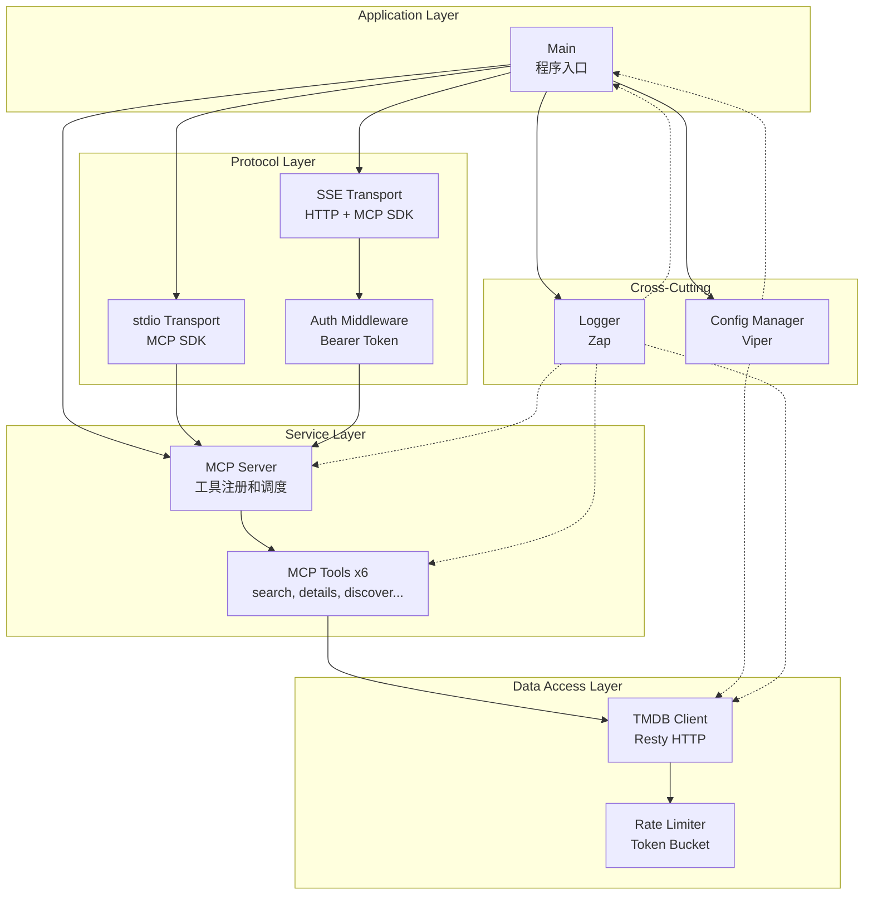
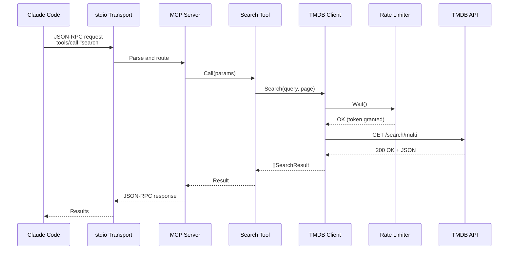
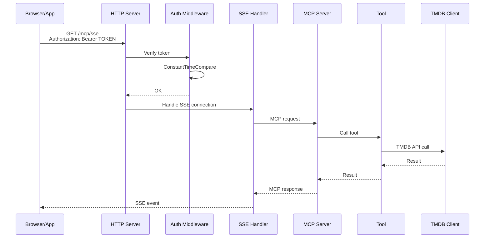

# Components

基于分层架构，以下是核心组件及其职责定义：

## Main Application (cmd/tmdb-mcp/main.go)

**Responsibility**: 应用程序入口，负责初始化所有组件并启动服务

**Key Interfaces**:
- `func main()` - 程序入口函数
- 信号处理（SIGINT/SIGTERM）- 优雅关闭

**Dependencies**: Config, Logger, TMDB Client, MCP Server, HTTP Server

**Technology Stack**: Go 标准库（`os`, `os/signal`, `context`）

**Implementation Details**:
```go
func main() {
    // 1. 加载配置（Viper）
    config := loadConfig()

    // 2. 初始化日志（Zap）
    logger := initLogger(config.Logging)

    // 3. 创建 TMDB Client（Resty + Rate Limiter）
    tmdbClient := tmdb.NewClient(config.TMDB, logger)

    // 4. 创建 MCP Server（MCP SDK）
    mcpServer := mcp.NewServer(tmdbClient, logger)

    // 5. 根据模式启动服务
    if config.Server.Mode == "stdio" || config.Server.Mode == "both" {
        go mcpServer.ServeStdio()
    }
    if config.Server.Mode == "sse" || config.Server.Mode == "both" {
        go serveSSE(mcpServer, config.Server.SSE, logger)
    }

    // 6. 等待信号并优雅关闭
    waitForShutdown(mcpServer, logger)
}
```

## Config Manager (internal/config)

**Responsibility**: 管理配置加载、验证和优先级控制（CLI > ENV > File）

**Key Interfaces**:
- `func LoadConfig() (*Config, error)` - 加载配置
- `func ValidateConfig(*Config) error` - 验证配置有效性
- `func GenerateSSEToken() (string, error)` - 生成 SSE Token

**Dependencies**: Viper, crypto/rand

**Technology Stack**: `github.com/spf13/viper`, `crypto/rand`, `os`

**Configuration Priority**:
1. 命令行 flags（最高优先级）
2. 环境变量（`TMDB_API_KEY`, `SSE_TOKEN` 等）
3. 配置文件 `~/.tmdb-mcp/config.yaml`（默认优先级）

**Validation Rules**:
- TMDB API Key 必须存在且非空
- SSE 模式启用时，Token 必须存在或自动生成
- Rate Limit 必须 > 0（默认 40）
- Server Mode 必须是 "stdio", "sse", "both" 之一

## TMDB API Client (internal/tmdb)

**Responsibility**: 封装 TMDB API v3 调用，处理 HTTP 请求、错误和响应解析

**Key Interfaces**:
- `func Search(ctx context.Context, query string, page int) ([]SearchResult, error)`
- `func GetMovieDetails(ctx context.Context, id int) (*MovieDetails, error)`
- `func GetTVDetails(ctx context.Context, id int) (*TVDetails, error)`
- `func GetPersonDetails(ctx context.Context, id int) (*PersonDetails, error)`
- `func DiscoverMovies(ctx context.Context, params DiscoverMoviesParams) ([]MovieResult, error)`
- `func DiscoverTV(ctx context.Context, params DiscoverTVParams) ([]TVResult, error)`
- `func GetTrending(ctx context.Context, mediaType, timeWindow string, page int) ([]TrendingResult, error)`
- `func GetMovieRecommendations(ctx context.Context, id, page int) ([]MovieResult, error)`
- `func GetTVRecommendations(ctx context.Context, id, page int) ([]TVResult, error)`

**Dependencies**: Resty, Rate Limiter, Logger

**Technology Stack**: `github.com/go-resty/resty/v2`, `golang.org/x/time/rate`, Zap

**Implementation Pattern**:
```go
type Client struct {
    httpClient  *resty.Client
    rateLimiter *rate.Limiter
    apiKey      string
    language    string
    logger      *zap.Logger
}

func (c *Client) Search(ctx context.Context, query string, page int) ([]SearchResult, error) {
    // 1. 等待速率限制
    if err := c.rateLimiter.Wait(ctx); err != nil {
        return nil, err
    }

    // 2. 发起 HTTP 请求
    resp, err := c.httpClient.R().
        SetContext(ctx).
        SetQueryParam("query", query).
        SetQueryParam("page", strconv.Itoa(page)).
        Get("/search/multi")

    // 3. 错误处理（401/404/429）
    if err := c.handleError(resp); err != nil {
        return nil, err
    }

    // 4. 解析响应
    var result SearchResponse
    if err := json.Unmarshal(resp.Body(), &result); err != nil {
        return nil, err
    }

    return result.Results, nil
}
```

**Error Handling Strategy**:
- **401 Unauthorized**: 立即返回错误，记录 ERROR 日志
- **404 Not Found**: 返回空结果，记录 INFO 日志
- **429 Rate Limit**: 解析 `Retry-After` header，等待后重试（最多 3 次）
- **Network Timeout**: 返回错误，记录 WARN 日志
- **5xx Server Error**: 返回错误，记录 ERROR 日志

## Rate Limiter (internal/ratelimit)

**Responsibility**: 控制 TMDB API 调用频率，防止触发 429 错误

**Key Interfaces**:
- `func NewLimiter(ratePerSecond float64, burst int) *rate.Limiter` - 创建限制器
- `func Wait(ctx context.Context) error` - 等待获取令牌

**Dependencies**: golang.org/x/time/rate

**Technology Stack**: `golang.org/x/time/rate`

**Configuration**:
- **Rate**: 40 requests / 10 seconds = 4 req/s
- **Burst**: 40（允许短时突发）
- **Algorithm**: Token Bucket

**Usage**:
```go
// 创建限制器：每秒 4 个请求，突发 40
limiter := rate.NewLimiter(rate.Every(10*time.Second/40), 40)

// 每次 API 调用前等待
if err := limiter.Wait(ctx); err != nil {
    return err
}
```

## MCP Server (internal/mcp)

**Responsibility**: MCP 协议实现，工具注册和调度，stdio 和 SSE 模式支持

**Key Interfaces**:
- `func NewServer(tmdbClient *tmdb.Client, logger *zap.Logger) *mcp.Server` - 创建服务器
- `func ServeStdio() error` - 启动 stdio 模式
- `func GetHTTPHandler() http.Handler` - 获取 SSE HTTP Handler

**Dependencies**: MCP SDK, TMDB Client, Tools, Logger

**Technology Stack**: `github.com/modelcontextprotocol/go-sdk`, Zap

**Tool Registration**:
```go
func NewServer(tmdbClient *tmdb.Client, logger *zap.Logger) *mcp.Server {
    server := mcp.NewServer(mcp.ServerInfo{
        Name:    "tmdb-mcp",
        Version: "1.0.0",
    })

    // 注册 6 个工具
    server.AddTool(tools.NewSearchTool(tmdbClient, logger))
    server.AddTool(tools.NewGetDetailsTool(tmdbClient, logger))
    server.AddTool(tools.NewDiscoverMoviesTool(tmdbClient, logger))
    server.AddTool(tools.NewDiscoverTVTool(tmdbClient, logger))
    server.AddTool(tools.NewGetTrendingTool(tmdbClient, logger))
    server.AddTool(tools.NewGetRecommendationsTool(tmdbClient, logger))

    return server
}
```

## MCP Tools (internal/tools)

**Responsibility**: 实现 6 个 MCP 工具，处理参数验证和结果转换

**Key Interfaces**:
- `func (t *SearchTool) Call(ctx context.Context, params json.RawMessage) (interface{}, error)`
- 每个工具实现 `mcp.Tool` 接口

**Dependencies**: TMDB Client, Logger

**Technology Stack**: MCP SDK, Zap

**Tool List**:
1. **SearchTool** - 搜索电影/电视剧/人物
2. **GetDetailsTool** - 获取详情（movie/tv/person）
3. **DiscoverMoviesTool** - 发现电影
4. **DiscoverTVTool** - 发现电视剧
5. **GetTrendingTool** - 获取热门内容
6. **GetRecommendationsTool** - 获取推荐

**Implementation Pattern**:
```go
type SearchTool struct {
    tmdbClient *tmdb.Client
    logger     *zap.Logger
}

func (t *SearchTool) Name() string {
    return "search"
}

func (t *SearchTool) Description() string {
    return "Search for movies, TV shows, and people on TMDB"
}

func (t *SearchTool) Call(ctx context.Context, params json.RawMessage) (interface{}, error) {
    // 1. 解析参数
    var searchParams SearchParams
    if err := json.Unmarshal(params, &searchParams); err != nil {
        return nil, err
    }

    // 2. 验证参数
    if searchParams.Query == "" {
        return nil, errors.New("query parameter is required")
    }

    // 3. 调用 TMDB Client
    results, err := t.tmdbClient.Search(ctx, searchParams.Query, searchParams.Page)
    if err != nil {
        t.logger.Error("Search failed", zap.Error(err))
        return nil, err
    }

    // 4. 返回结果
    return results, nil
}
```

## HTTP Server (internal/server)

**Responsibility**: 提供 SSE HTTP 服务，实现 Bearer Token 认证中间件

**Key Interfaces**:
- `func NewHTTPServer(mcpServer *mcp.Server, config SSEConfig, logger *zap.Logger) *http.Server`
- `func Start() error` - 启动服务器
- `func Shutdown(ctx context.Context) error` - 优雅关闭

**Dependencies**: MCP Server, net/http, Logger

**Technology Stack**: `net/http` (标准库), MCP SDK 的 `SSEHTTPHandler`, Zap

**Endpoints**:
- `GET /mcp/sse` - MCP over SSE 连接（需要认证）
- `GET /health` - 健康检查（无需认证）

**Authentication Middleware**:
```go
func AuthMiddleware(expectedToken string) func(http.Handler) http.Handler {
    return func(next http.Handler) http.Handler {
        return http.HandlerFunc(func(w http.ResponseWriter, r *http.Request) {
            // 提取 Authorization header
            authHeader := r.Header.Get("Authorization")
            if authHeader == "" {
                http.Error(w, "Unauthorized", http.StatusUnauthorized)
                return
            }

            // 验证 Bearer token
            token := strings.TrimPrefix(authHeader, "Bearer ")
            if subtle.ConstantTimeCompare([]byte(token), []byte(expectedToken)) != 1 {
                http.Error(w, "Unauthorized", http.StatusUnauthorized)
                return
            }

            // 认证通过，调用下一个 handler
            next.ServeHTTP(w, r)
        })
    }
}
```

**Server Setup**:
```go
func NewHTTPServer(mcpServer *mcp.Server, config SSEConfig, logger *zap.Logger) *http.Server {
    mux := http.NewServeMux()

    // 健康检查端点（无需认证）
    mux.HandleFunc("/health", func(w http.ResponseWriter, r *http.Request) {
        json.NewEncoder(w).Encode(map[string]string{"status": "ok"})
    })

    // SSE 端点（需要认证）
    sseHandler := mcp.NewSSEHTTPHandler(func(*http.Request) *mcp.Server {
        return mcpServer
    })
    mux.Handle("/mcp/sse", AuthMiddleware(config.Token)(sseHandler))

    return &http.Server{
        Addr:    fmt.Sprintf("%s:%d", config.Host, config.Port),
        Handler: mux,
    }
}
```

## Logger (internal/logger)

**Responsibility**: 提供结构化日志功能，记录关键事件和错误

**Key Interfaces**:
- `func InitLogger(config LogConfig) (*zap.Logger, error)` - 初始化 logger
- Zap logger 标准接口（`Info`, `Error`, `Debug`, `Warn`）

**Dependencies**: Zap

**Technology Stack**: `go.uber.org/zap`

**Configuration**:
- **Development Mode**: 使用 `zap.NewDevelopment()`，输出到 console，彩色输出
- **Production Mode**: 使用 `zap.NewProduction()`，JSON 格式，结构化输出
- **Log Level**: 从配置文件读取（debug/info/warn/error）

**Usage**:
```go
logger.Info("Starting TMDB MCP Service",
    zap.String("mode", config.Server.Mode),
    zap.Int("port", config.Server.SSE.Port),
)

logger.Error("TMDB API call failed",
    zap.String("endpoint", "/search/multi"),
    zap.Error(err),
    zap.Duration("duration", elapsed),
)
```

## Component Diagrams



## Component Interaction Sequence

**stdio 模式请求流程**:


**SSE 模式请求流程**:


---
