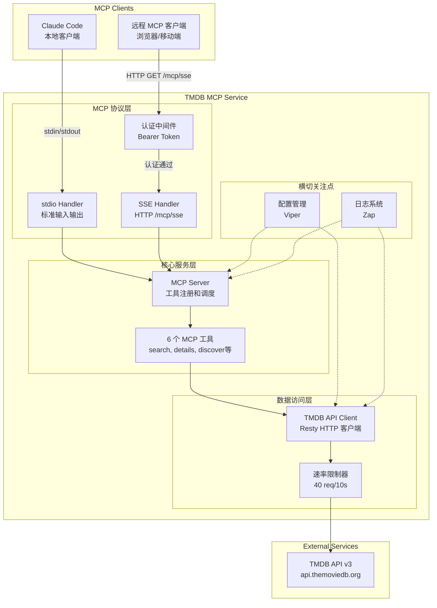

# High Level Architecture

## Technical Summary

TMDB MCP 服务采用**分层单体架构**(Layered Monolith),以 Golang 1.21+ 实现。系统通过 MCP 协议暴露 6 个核心工具,支持 stdio 和 SSE 双模式通信。核心组件包括 MCP 协议层、工具编排层、TMDB API 客户端层和速率限制层。架构设计确保高性能(P95 < 500ms)、类型安全和天然并发支持,同时遵循精简原则,仅使用 Go 原生工具链。该设计直接支持 PRD 中定义的智能文件重命名、内容发现和推荐等核心场景。

## High Level Overview

**架构风格**: **Layered Monolith**(分层单体架构)

**Repository 结构**: **Monorepo** - 单个 Git 仓库包含所有代码

**Service 架构**: **Single-Process Service** - 单进程服务,支持 stdio 和 SSE 双模式

**核心架构层次**:
```
┌─────────────────────────────────────────────────┐
│          MCP 协议层 (Protocol Layer)              │
│  - stdio transport (标准输入/输出)                │
│  - SSE transport (HTTP Server-Sent Events)      │
│  - JSON-RPC 2.0 消息处理                         │
└─────────────────────────────────────────────────┘
                      ↓
┌─────────────────────────────────────────────────┐
│         工具层 (Tools Layer)                     │
│  - search, get_details, discover_movies         │
│  - discover_tv, get_trending, get_recommendations│
│  - 参数验证和结果转换                             │
└─────────────────────────────────────────────────┘
                      ↓
┌─────────────────────────────────────────────────┐
│      TMDB 客户端层 (TMDB Client Layer)           │
│  - HTTP 请求封装 (Resty)                         │
│  - 错误处理和重试逻辑                             │
│  - 响应解析和类型映射                             │
└─────────────────────────────────────────────────┘
                      ↓
┌─────────────────────────────────────────────────┐
│     速率限制层 (Rate Limiter Layer)               │
│  - Token Bucket 算法 (40 req/10s)                │
│  - 并发请求队列管理                               │
└─────────────────────────────────────────────────┘
                      ↓
┌─────────────────────────────────────────────────┐
│         TMDB API v3 (外部服务)                    │
└─────────────────────────────────────────────────┘
```

**关键架构决策**:

1. **单体 vs 微服务**: 选择单体架构
   - **理由**: MVP 阶段功能单一,6 个工具共享 TMDB 客户端和速率限制器,微服务会引入不必要的复杂性

2. **双模式支持**: stdio + SSE 同时运行
   - **理由**: stdio 模式用于本地 Claude Code 集成,SSE 模式支持远程访问和多客户端连接
   - **实现**: 共享工具层和 TMDB 客户端,仅传输层不同

3. **分层设计**: 清晰的职责分离
   - **协议层**: 仅处理通信和消息序列化
   - **工具层**: 业务逻辑和参数验证
   - **客户端层**: TMDB API 交互
   - **速率限制层**: 保证不触发 TMDB 限流

## High Level Project Diagram



## Architectural and Design Patterns

以下是指导本架构的关键高级模式:

- **Layered Architecture (分层架构)**: 将系统分为协议层、业务层、数据访问层,确保职责清晰分离和可测试性 - _Rationale:_ 单进程架构中最佳实践,支持独立测试每一层,符合 SOLID 原则

- **Dependency Injection (依赖注入)**: 通过构造函数注入依赖(如 TMDBClient 注入到 Tools) - _Rationale:_ Go 的惯用方式,便于单元测试时 Mock 外部依赖,无需引入 DI 框架

- **Repository Pattern (仓储模式)**: TMDBClient 作为数据访问抽象,隐藏 HTTP 调用细节 - _Rationale:_ 工具层无需关心 TMDB API 的 HTTP 细节,未来可替换为其他数据源

- **Middleware Pattern (中间件模式)**: SSE 模式使用标准库 `net/http` 中间件实现认证 - _Rationale:_ Go HTTP 标准模式,可组合和复用,符合 Go 惯用法

- **Rate Limiting Pattern (速率限制模式)**: 使用 Token Bucket 算法控制 TMDB API 调用频率 - _Rationale:_ 防止触发 TMDB 429 错误,Token Bucket 平滑处理突发流量

- **Dual Mode Pattern (双模式模式)**: stdio 和 SSE 共享业务逻辑,仅传输层不同 - _Rationale:_ 避免代码重复,两种模式使用相同的工具实现和 TMDB 客户端,降低维护成本

- **Graceful Shutdown Pattern (优雅关闭模式)**: 捕获 SIGINT/SIGTERM 信号,等待活跃连接完成后关闭 - _Rationale:_ 确保请求处理完整,避免数据丢失或不一致状态

---
